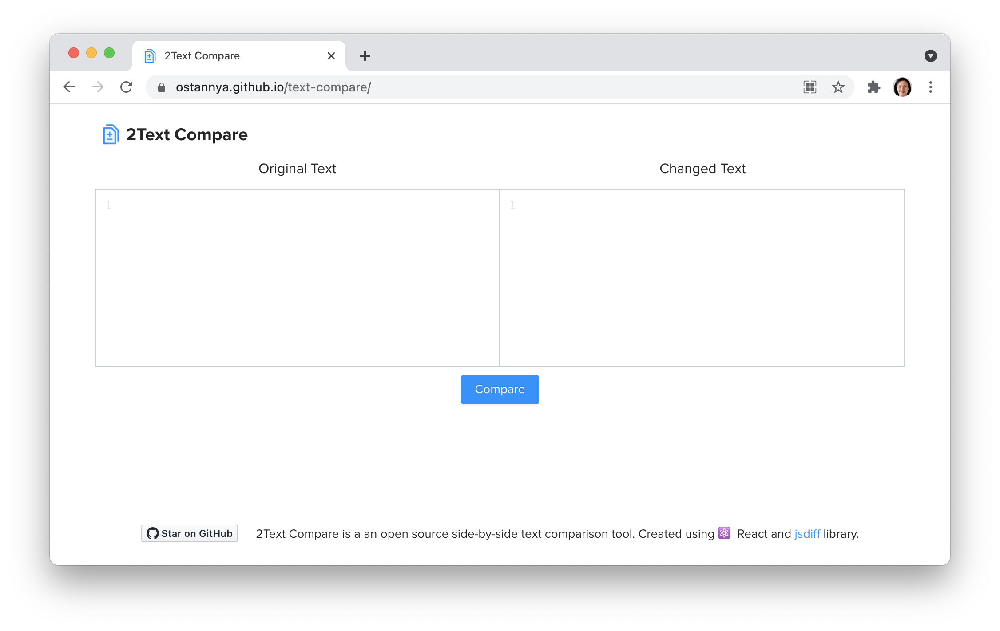

# 2Text Compare
2Text Compare is a an open source side-by-side text comparison tool that helps to find duplicate content. It doesn’t store any data neither use analytics to track users. Created using ⚛️ React and <a href='https://github.com/kpdecker/jsdiff'>jsdiff</a> library.

<a href="https://ostannya.github.io/text-compare/">Try Text Compare</a>

## Features
* Compare two texts
* To lowercase
* Replace breaks with spaces
* Remove excess whitespaces 

## Used Components
* [Create React App](https://create-react-app.dev/) 
* UI by [Ant Design](https://ant.design/)
* Comparison by [jsdiff library](https://github.com/kpdecker/jsdiff)

## Install
- clone repo
- run `$ npm install`

If you like Text Compare, please, give it ⭐️ on GitHub!